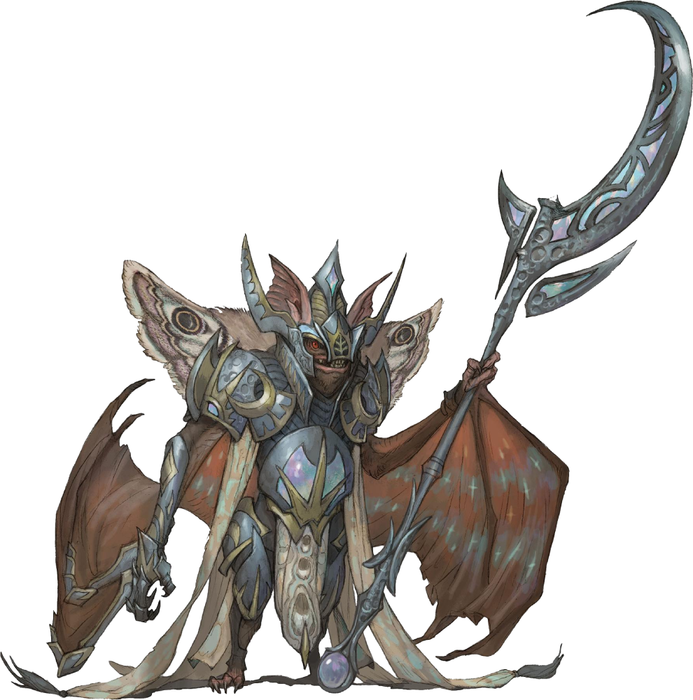

# Cosmos Priest

*Small humanoid (batfolk), Any Alignment*

---

**Armor Class** 13
**Hit Points** 27 (6d6 + 6)
**Speed** 30 ft., fly 30 ft.

---

|STR|DEX|CON|INT|WIS|CHA|
|:---:|:---:|:---:|:---:|:---:|:---:|
|10 (+0)|10 (+0)|12 (+1)|13 (+1)|16 (+3)|13 (+1)|

---

**Skills** Nature +2, Religion +4, Survival +2
**Senses** blindsight 60 ft., passive Perception 14
**Languages** Common
**Challenge** 2

---

***Echolocation.*** The cosmos priest can't use its blindsight while deafened.

### Spellcasting (Cleric)
The priest casts one of the following spells, using Wisdom as the spellcasting ability (spell save DC 13):
- **At will:** *light, thaumaturgy*
- **1/day each:** *dispel magic, moonbeam*

### Actions

***Channel Essence.*** One willing creature or one creature that has the grappled, incapacitated, or restrained condition must make a DC 13 Constitution saving throw. On a failure, it takes 7 (2d6) necrotic damage, and the priest gains temporary hit points equal to the necrotic damage taken.

***Glaive.*** *Melee Weapon Attack:* +5 to hit, reach 10 ft., one target. *Hit:* 8 (1d10 + 3) slashing damage plus 1d6 radiant damage.

---

> Aside from a few cults, such the snail cult run by Wick or cults that revere the Calamity Beasts, the religion of Bloomburrow is predominantly practiced and dictated by the Batfolk. They believe their ancestors join the Cosmos in death and are assigned stars. The Batfolk pray to these ancestors for guidance, and the magic of the Cosmos can be channeled as divine magic. Many larger settlements, such as Three Tree City, have Batfolk churches which double as observatories.

