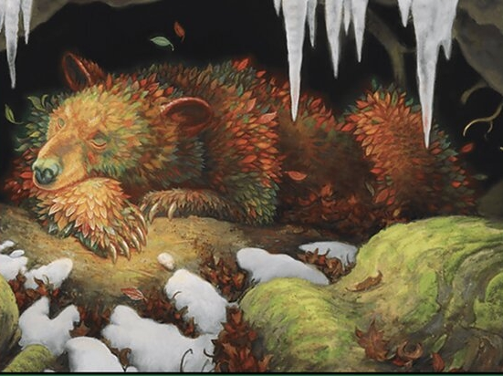

# Evercoat Ursine

*Large elemental, Unaligned*

---

**Armor Class** 19
**Hit Points** 170 (20d10 + 60)
**Speed** 40 ft.

---

|STR|DEX|CON|INT|WIS|CHA|
|:---:|:---:|:---:|:---:|:---:|:---:|
|20 (+5)|10 (+0)|16 (+3)|2 (-4)|13 (+1)|7 (-2)|

---

**Skills** Perception +9
**Damage Resistances** cold
**Senses** darkvision 60 ft., passive Perception 19
**Languages** ---
**Challenge** 10

---

***Sleep Aura.*** Any creature that starts its turn in a 10-foot emanation originating from the ursine must make a DC 15 Wisdom saving throw. On a failed save, until the start of its next turn, the target is incapacitated, its Speed is halved, and it takes a –2 penalty to its AC.

***Magic Resistance.*** The evercoat ursine has advantage on saving throws against spells and other magical effects.

### Actions

***Multiattack.*** The ursine makes two Rend attacks. It can replace one attack with a use of Spellcasting.

***Rend.*** *Melee Weapon Attack:* +9 to hit, reach 5 ft., one target. *Hit:* 16 (3d8 + 3) slashing damage, and the target is knocked prone if it is Medium or smaller.

---

> The Evercoat Ursine is a Calamity Beast that appears as a large bear. At first glance, it might appear to have a brown fur coat, but its fur is actually made of leaves; a few of them are green in color, but most take the orange and red shades of autumn leaves.
>
> **Season of Autumn.** Autumn is the season that the Evercoat Ursine brings. As it marches through the woods around Valley, trees lose their leaves and enter a deep slumber. Other creatures also feel sluggish and sleepy in the bear's presence. It emerges infrequently, spending most of its time hibernating in large caves. The Ursine is usually woken from its sleep by the passing of the Sun Hawk that brings the summer, and once he goes to sleep, the Blizzard Elk often emerges.
>
> Treasure: Relics

