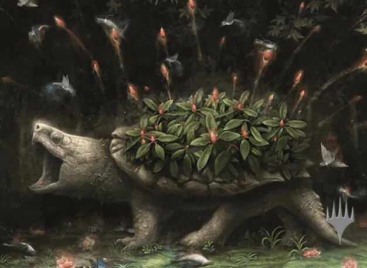

# Fecund Greenshell

*Huge elemental, Unaligned*

---

**Armor Class** 17
**Hit Points** 178 (17d12 + 68)
**Speed** 20 ft.

---

|STR|DEX|CON|INT|WIS|CHA|
|:---:|:---:|:---:|:---:|:---:|:---:|
|28 (+9)|3 (-4)|19 (+4)|4 (-3)|10 (+0)|5 (-3)|

---

**Damage Immunities** poison
**Condition Immunities** poisoned
**Senses** darkvision 60 ft., passive Perception 10
**Languages** ---
**Challenge** 8

---

***Overgrowth Aura.*** The ground in a 20-foot emanation originating from the greenshell is difficult terrain.

### Actions

***Bite.*** *Melee Weapon Attack:* +12 to hit, reach 10 ft., one target. *Hit:* 28 (3d12 + 9) piercing damage.

***Shell Defense.*** The greenshell withdraws into its shell. While withdrawn, its AC is 22, it is prone and restrained, and it can't take actions or reactions. It can use a bonus action to emerge from its shell.

***Seed Burst (Recharge 5-6).*** Each creature within 15 feet of the greenshell must make a DC 16 Dexterity saving throw. On a failed save, a creature takes 35 (10d6) bludgeoning damage. On a successful save, a creature takes half as much damage.

---

> The Fecund Greenshell is a minor Calamity Beast taking the shape of a large turtle or tortoise. It has stony skin, and its shell is covered in plants with green leaves and glowing red seeds. The greenshell is not powerful enough to bring its own season, but when it arrives, life blossoms around it. As a defense mechanism when other creatures get too close, the greenshell will fire the seeds off its shell.
>
> Treasure: Implements

