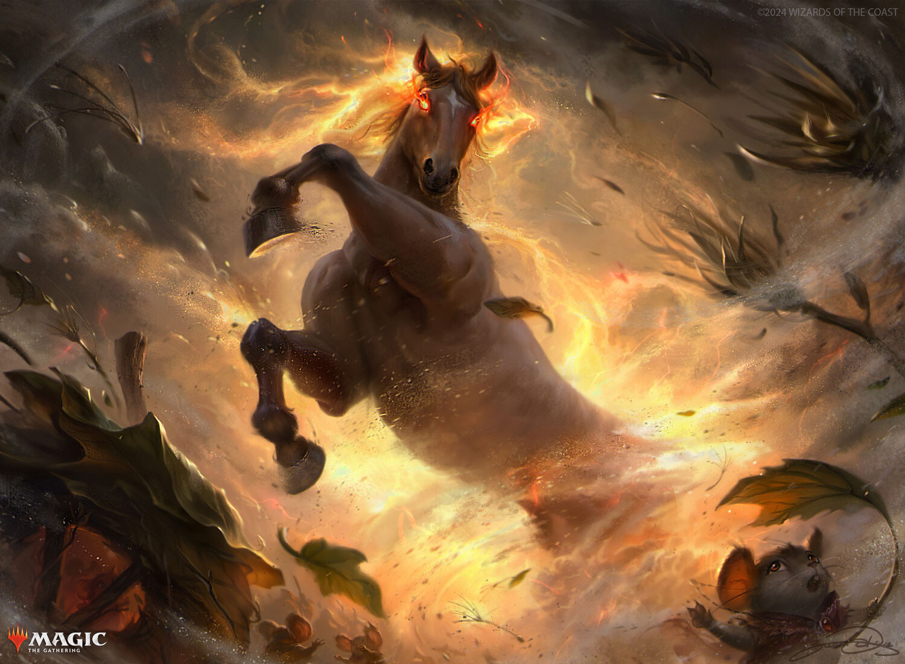

# Sandcloud Harbinger

*Large elemental, Neutral*

---

**Armor Class** 12
**Hit Points** 67 (9d10 + 18)
**Speed** 50 ft.

---

|STR|DEX|CON|INT|WIS|CHA|
|:---:|:---:|:---:|:---:|:---:|:---:|
|18 (+4)|14 (+2)|15 (+2)|2 (-4)|17 (+3)|7 (-2)|

---

**Senses** darkvision 60 ft., passive Perception 13
**Languages** ---
**Challenge** 5

---

***Sand Aura.*** Creatures in a 20-foot emanation originating from the harbinger have disadvantage on attack rolls with weapons and Wisdom (Perception) checks. A flying creature in the emanation must land at the end of its turn or fall. The emanation also extinguishes open flames and disperses fog.

### Actions

***Multiattack.*** The harbinger makes two Hooves attacks.

***Hooves.*** *Melee Weapon Attack:* +7 to hit, reach 0 ft., one target. *Hit:* 17 (3d8 + 4) bludgeoning damage. If the harbinger moved at least 20 feet straight toward the target immediately before the hit, the target takes an extra 9 (2d8) bludgeoning damage and is knocked prone if it is Large or smaller.

***Mirage (1/Day).*** The harbinger casts *hallucinatory terrain*, requiring no components and using Wisdom as the spellcasting ability (spell save DC 14).

### Reactions

***Retaliating Hooves.*** *Trigger:* The harbinger takes damage. *Response:* The harbinger makes one Hooves attack.

***Sandy Shield.*** *Trigger:* The harbinger is hit by an attack roll. *Response:* The harbinger adds 3 to its AC against that attack, possibly causing the attack to miss.

---

> The Sandcloud Harbinger is a minor Calamity Beast that appears as a large horse, with a brown coat and a white star on its forehead. Its eyes blaze with fire, and it is constantly surrounded by a sand storm. The elemental winds and sand are so strong, that if left unchecked, the land it moves through will be transformed into a desert.
>
> Treasure: Relics

