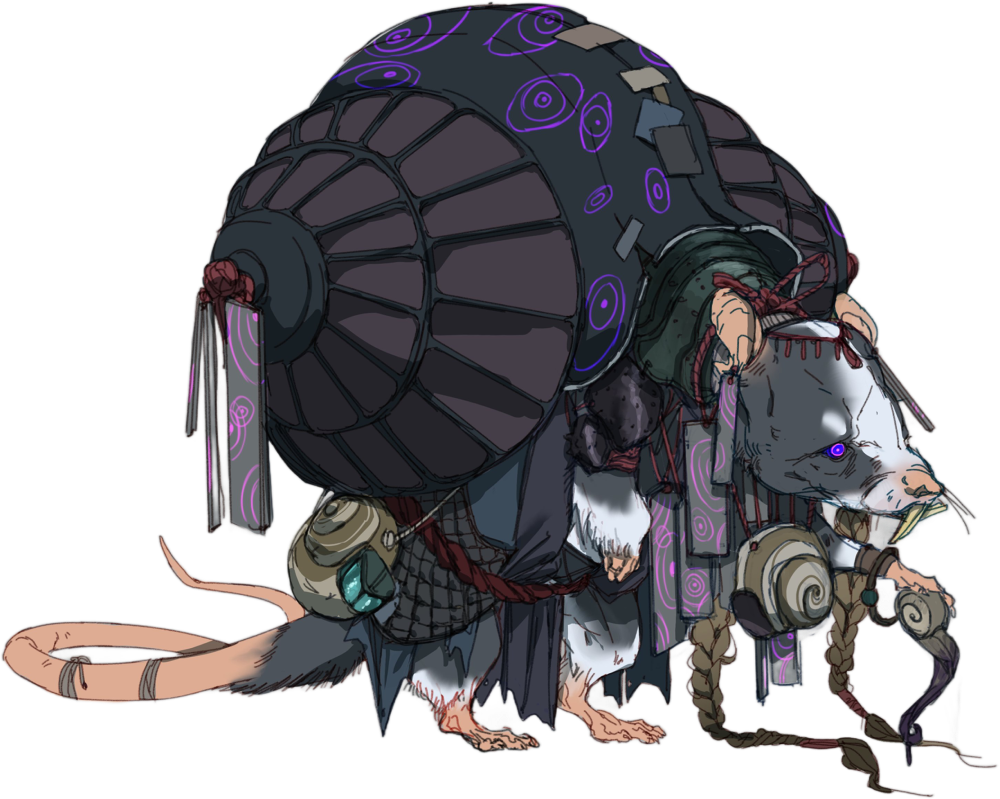

# Wick

*Small humanoid (ratfolk), Chaotic Neutral*

---

**Armor Class** 14
**Hit Points** 40 (9d6 + 9)
**Speed** 25 ft.

---

|STR|DEX|CON|INT|WIS|CHA|
|:---:|:---:|:---:|:---:|:---:|:---:|
|12 (+1)|15 (+2)|12 (+1)|10 (+0)|13 (+1)|14 (+2)|

---

**Skills** Persuasion +4, Perception +3
**Senses** passive Perception 13
**Languages** Common
**Challenge** 2

---

### Spellcasting (Warlock)
Wick casts one of the following spells, using Charisma as the spellcasting ability (spell save DC 12):
- **At will:** *friends, mage hand* (the hand has the invisible condition)
- **2/day:** *command*

### Actions

***Multiattack.*** Wick makes two Whorled Staff attacks. He can replace one attack with a use of Spellcasting.

***Whorled Staff.*** *Melee Weapon Attack:* +4 to hit, reach 5 ft., one target. *Hit:* 6 (1d8 + 2) magical bludgeoning damage, plus 9 (2d8) psychic damage.

***Summon Snails (1/Day).*** Wick summons 2d4 Snails that appear in unoccupied spaces Wick can see within 60 ft. The called creatures are allies to Wick and his allies, and remain for 1 hour, until Wick dies, or until Wick dismisses them as a bonus action.

---

> Wick is a bent and wiry figure, draped in a purple robe and dangling adornments with mystical symbols and arcane patterns over his shoulder. His fur is a dark shade of gray, with a few silver streaks adding a touch of aged wisdom to his appearance. His piercing, violet eyes glow with an unsettling intelligence, and his whiskers twitch with an air of constant calculation. Upon his back, Wick wears a giant snail shell like an extravagant backpack, filled to the brim with knickknacks and baubles. Numerous smaller snails surround him.
>
> **Worship of the Snail.** As a young pup raised in the marshland village of Conch, Wick was a prodigy amongst a community of psychics. He grew inseparable from the snail Grotgyre, their psychic bond so deeply engrained they could anticipate each other's thoughts. Then, a sickness befell the snails of Conch, and Wick along with them. He became haunted by visions of whorls and eyes, sleep eluding him. He was awake all hours of the night jotting out scripture until some years later when his paranoia ascended into enlightenment. Wick found comfort in his connection to the snails and sought to spread it. He left his village alongside a few like-minded psychics to proselytize, recruiting followers to tunnel out spiraling, labyrinthian passages into the earth where he and his converts reclused. Each new member is subjected to the same taxing initiation that Wick endured, a connection to an anointed snail forged in exchange for ultimate truth. They revere every aspect of their snails—worship them, consume their flesh, convert what's left into magic—then a new connection is forged. With it, the cycle begins anew in a never-ending spiral.
>
> Treasure: Arcana

