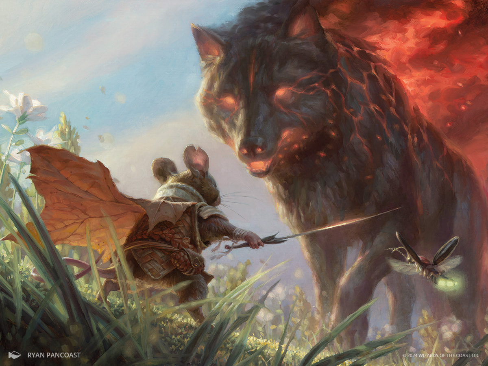

# Wildsear

*Huge elemental, Neutral*

---

**Armor Class** 16
**Hit Points** 200 (16d12 + 96)
**Speed** 30 ft.

---

|STR|DEX|CON|INT|WIS|CHA|
|:---:|:---:|:---:|:---:|:---:|:---:|
|25 (+7)|16 (+3)|22 (+6)|4 (-3)|14 (+2)|7 (-2)|

---

**Skills** Perception +7
**Damage Vulnerabilities** cold
**Damage Immunities** fire
**Senses** passive Perception 17
**Languages** ---
**Challenge** 15

---

***Legendary Resistance (3/Day).*** If Wildsear fails a saving throw, it can choose to succeed instead.

***Fiery Aura.*** At the end of each of Wildsear’s turns, each creature in a 10-foot emanation originating from Wildsear takes 9 (2d8) fire damage. Creatures and flammable objects in the emanation start burning.

***Illumination (Fire Elemental).*** Wildsear sheds bright light in a 30-foot radius and dim light for an additional 30 feet.

### Spellcasting
Wildsear casts one of the following spells, requiring no material components, using Constitution as the spellcasting ability (spell save DC 19):
- **At will:** *heat metal*
- **1/day each:** *fire storm, wall of fire*

### Actions

***Multiattack.*** Wildsear makes two Bite attacks. It can replace one attack with a use of Spellcasting.

***Bite.*** *Melee Weapon Attack:* +12 to hit, reach 10 ft., one target. *Hit:* 11 (1d8 + 7) piercing damage, plus 7 (2d6) fire damage, and the target is knocked prone if it is Huge or smaller.

***Wildfire Howl (Recharge 5-6).*** Each creature within 60 feet must make a DC 19 Dexterity saving throw. On a failed save, a creature takes 16 (3d10) fire damage. On a successful save, a creature takes half as much damage.

### Reactions

Wildsear can take up to three Reactions per round but only one per turn.

***Ignite.*** *Trigger:* Another creature Wildsear can see ends its turn. *Response:* One creature or flammable object Wildsear can see within 60 feet starts burning.

***Rebuke.*** *Trigger:* Wildsear is hit with an attack. *Response:* One creature Wildsear can see within 60 feet must make a DC 19 Dexterity saving throw. On a failed save, a creature takes 11 (2d10) fire damage. On a successful save, a creature takes half as much damage.

---

> Wildsear has many names: the Wildfire Wolf, the Primordial Fire, the Season of Flames; whatever his epithet, he is an infamous Calamity Beast whose giant body sets fire to everything around it. Wildsear is a giant wolf whose eyes and maw are bright with flames, and whose burning back creates a column of smoke.
>
> Wildsear is not only the herald of wildfire, it is the literal manifestation of it. Wherever Wildsear steps, flames shoot out and catch on the surrounding landscape, causing havoc and devastation. The animalfolk say it burns through the seams of their plane and the next.
>
> **Season of Flames.** The season Wildsear brings is characterized by dryness, allowing even the smallest spark to start the grandest immolation. Frogfolk work overtime to attempt to magically bring the much needed rains, and crops are at risk of drying up and dying out. Animalfolk who make their homes in trees are especially at risk of their foundations catching alight.
>
> Treasure: None

